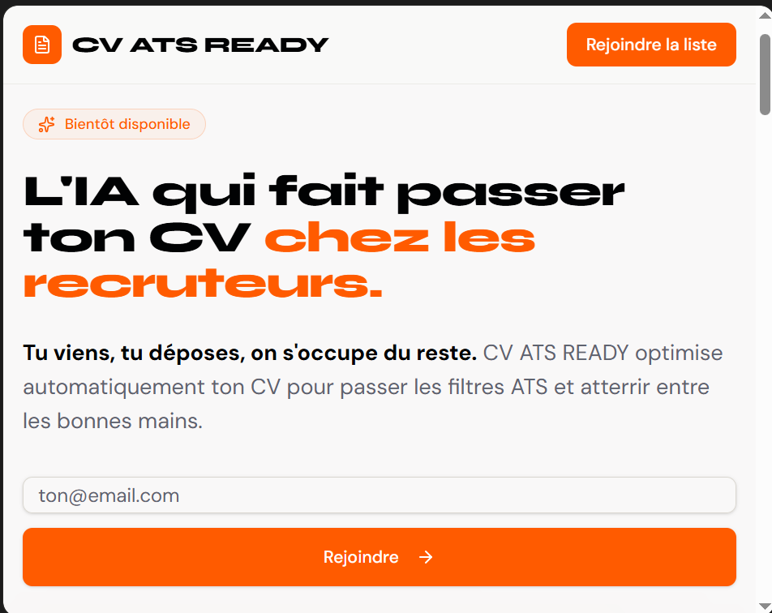
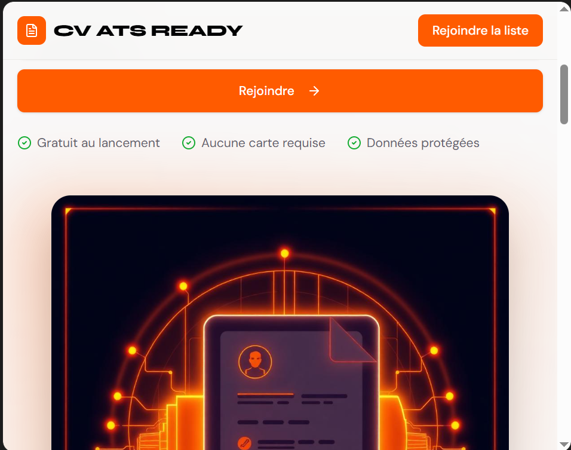
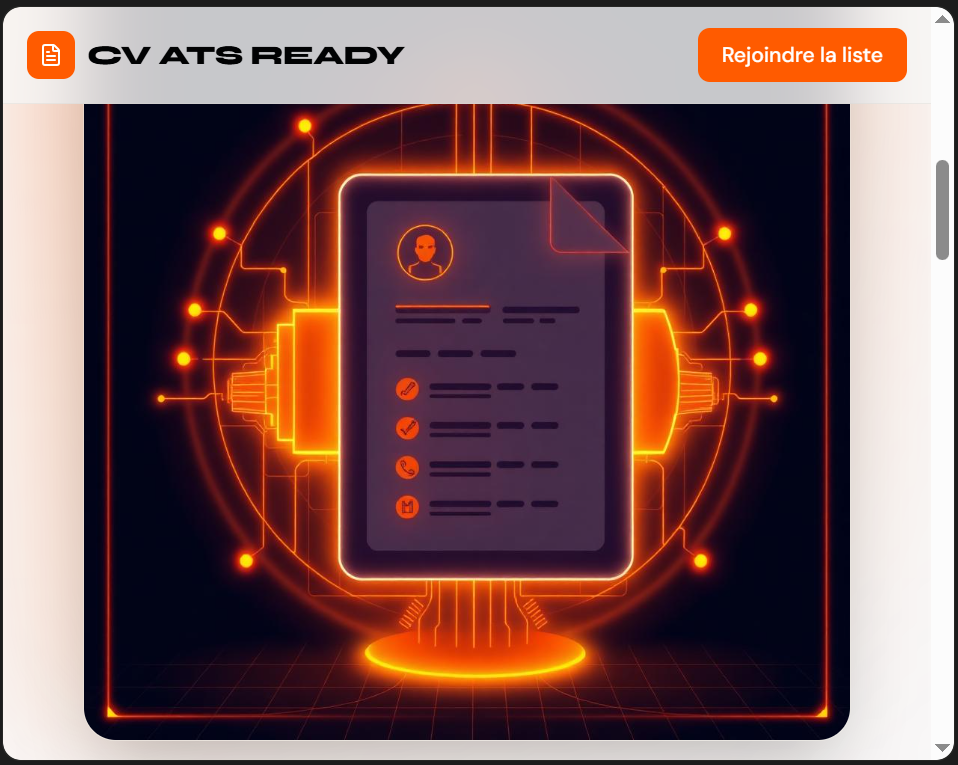
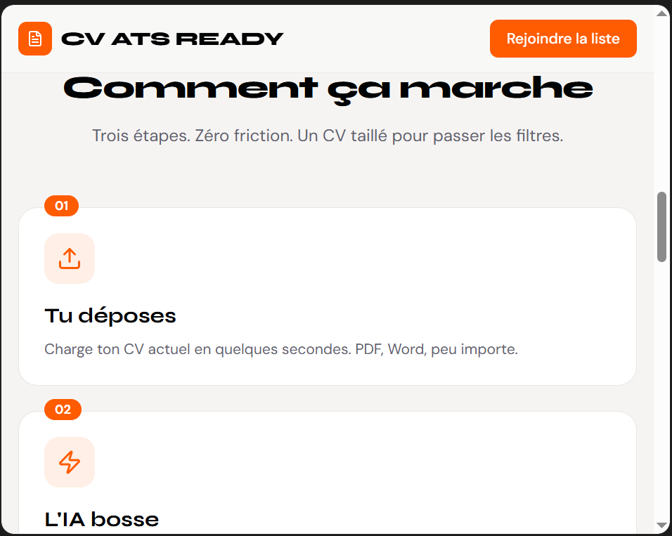
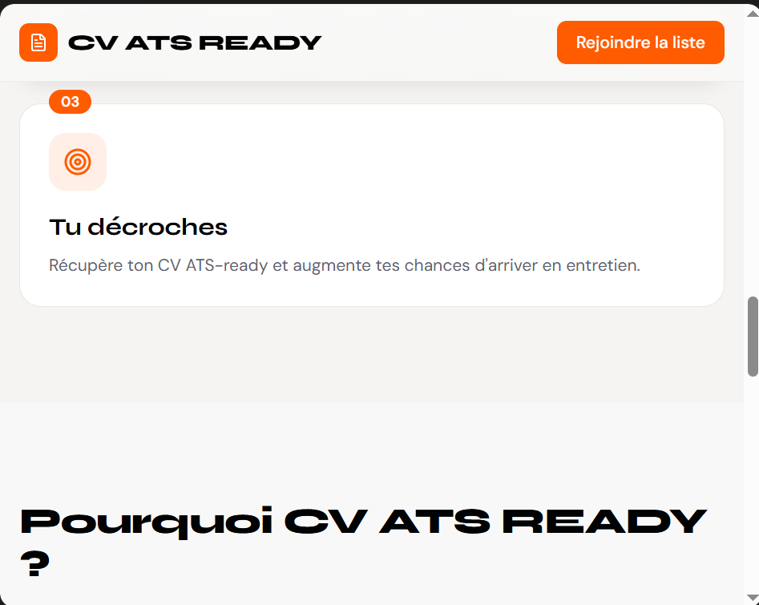
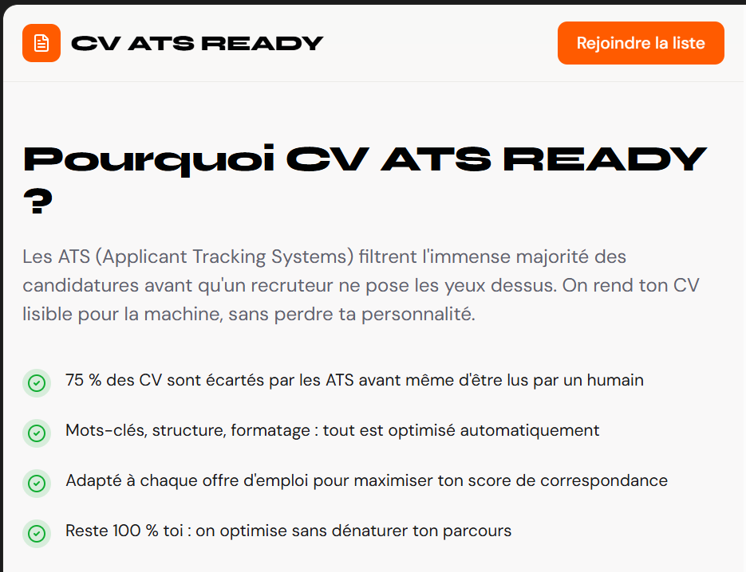
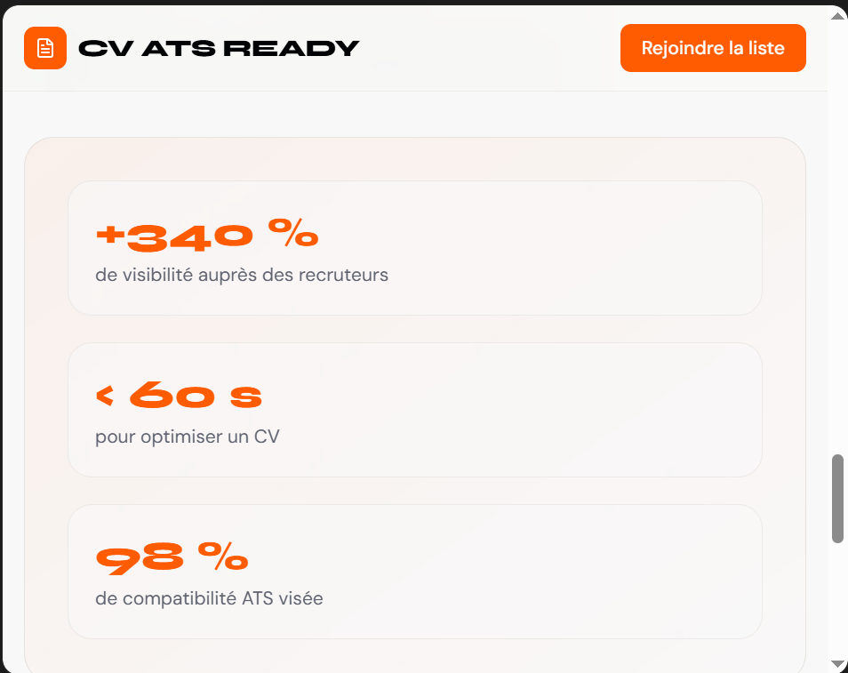
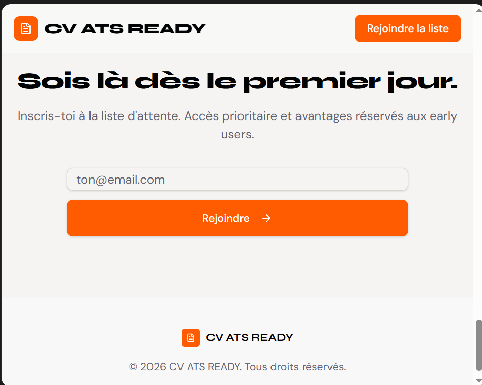

# CLAUDE.md — cv-ats-ready
> Mémoire projet complète. À coller en début de chaque nouvelle session.

---

## 🎯 Vision produit
**cv-ats-ready** (url : https://cv-ats-ready.fr)
Agent IA qui optimise automatiquement les CV pour les ATS (Applicant Tracking Systems).
**Tagline** : "Tu viens, tu déposes, on s'occupe du reste."
**Rôles** : Founder (utilisateur) + CTO (Claude)

---

## 👤 Profil Founder
- Passionné IA, data science, data analyse, entrepreneuriat
- Bootcamp data analyse complété, certification Hugging Face (smol agents)
- Connaissances : HTML, CSS, JS (intermédiaire), Python (débutant)
- Projets existants : Trajets Verts Paris · IA Éléphants de Côte d'Ivoire · cv-ats-ready
- Objectif moyen terme : incubation Station F / French Tech
- EmLyon Paris (formation Développeur) — réseau actif

---

## 🏗️ Stack technique (validée et fonctionnelle)

| Couche | Techno |
|--------|--------|
| Frontend | HTML/CSS/JS — fichier unique cv-ats-ready.html |
| Backend | Python FastAPI — dossier C:\Projects\cv_ats_ready\ |
| IA | Claude API — claude-haiku-4-5-20251001 |
| Paiement | Stripe (1€/optimisation) + codes promo |
| Export | PDF (reportlab) + DOCX (python-docx) en RAM |
| Parser CV | pypdf + pdfminer.six + python-docx |
| Analytics | Umami Cloud (RGPD) + endpoint /api/admin/logs |

---

## 📁 Structure du projet

```
C:\Projects\cv_ats_ready\
├── cv-ats-ready.html
├── main.py                    ← v1.1.0
├── utils/
│   ├── __init__.py
│   ├── ai_agent.py
│   ├── cv_parser.py
│   └── exporter.py
├── .env
├── .gitignore                 ← venv/, __pycache__/, .env
├── requirements.txt
└── Procfile
```

---

## 🔑 Variables d'environnement

### .env local
```
ANTHROPIC_API_KEY=sk-ant-api03-XXXX
STRIPE_SECRET_KEY=sk_test_51TA7v...
STRIPE_WEBHOOK_SECRET=
FRONTEND_URL=http://127.0.0.1:5500
ADMIN_SECRET=cv-ats-admin-2026
```

### Variables Railway (production)
```
ANTHROPIC_API_KEY=sk-ant-api03-XXXX
STRIPE_SECRET_KEY=sk_test_51TA7v...
STRIPE_WEBHOOK_SECRET=
FRONTEND_URL=https://cv-ats-ready.fr
ADMIN_SECRET=ton-secret-choisi
```

---

## 🎨 Charte graphique
```
Primaire : #FF6B00 | Primaire foncé : #D95A00
Fond sombre : #0C0C18 | Fond clair : #FAFAF8
Succès : #22C55E
Typo titres : Syne 800 | Typo corps : DM Sans
```

---

## 🚀 Lancer en local
```bash
cd C:\Projects\cv_ats_ready
venv\Scripts\activate
uvicorn main:app --reload --port 8000
```
Frontend : Live Server → http://127.0.0.1:5500
Dans HTML local : `const API_BASE = 'http://127.0.0.1:8000';`
En prod : `const API_BASE = 'https://web-production-ec873.up.railway.app';`

---

## 🌐 Infrastructure production

| Composant | Service | URL |
|-----------|---------|-----|
| Frontend | Netlify Drop | https://cv-ats-ready.netlify.app |
| Domaine | Ionos → Netlify (A: 75.2.60.5) | https://cv-ats-ready.fr |
| Backend | Railway EU West | https://web-production-ec873.up.railway.app |

---

## ✅ Statut MVP (02/04/2026)

| Feature | Statut |
|---------|--------|
| Upload CV PDF/DOCX drag & drop | ✅ |
| Code promo TEST_CV_ATS_READY | ✅ |
| Paiement Stripe 1€ | ✅ |
| CV réécrit ATS par Claude Haiku | ✅ |
| Score ATS avant/après + 4 catégories | ✅ |
| CV éditable avant téléchargement | ✅ |
| Lettre de motivation 6 styles | ✅ |
| Export PDF / DOCX / Texte | ✅ |
| Analytics Umami + /api/admin/logs | ✅ |
| Post LinkedIn publié | ✅ |
| Responsive mobile | ⏳ |

---

## 🎟️ Codes promo
```
TEST_CV_ATS_READY → 100% gratuit
BETA50            → -50%
LAUNCH20          → -20%
```

---

## 🔌 Endpoints
```
GET  /api/health
POST /api/create-payment-intent
POST /api/optimize              ← supporte edited_cv, edited_lm
GET  /api/admin/logs?secret=XXX
POST /api/webhook/stripe
```

---

## 📊 Analytics
- **Umami** : cloud.umami.is — Website ID : 1475d8a0-94a1-420c-ad21-4f3b5698430b
- **Dashboard** : https://web-production-ec873.up.railway.app/api/admin/logs?secret=ADMIN_SECRET

---

## ⚠️ Points d'attention (à corriger avant lancement public)
- CORS : `allow_origins=["*"]` → restreindre à cv-ats-ready.fr
- free_token bypass → remplacer par Redis/Postgres
- Stripe webhook secret → à configurer

---

## 📋 Prochaines tâches

```
SEMAINE 1-2  → Bêta fermée + retours testeurs ← ON EST ICI
SEMAINE 3    → Corrections + sécurisation CORS + Redis
SEMAINE 4    → Bêta ouverte (BETA50 -50%)
SEMAINE 5    → Lancement public 1€
MOIS 3-4     → SASU + dossier Station F
```

---

## 💰 Économie
```
Prix : 1€ HT | Net Stripe : ~0,73€ | Coût IA : ~0,02€ | Marge : ~95%
Crédits Anthropic : 16$ (≈500+ optimisations)
```

## Landing page images









